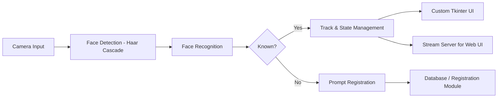

# Face Detection System Plan

## Overview
This project is a face detection and recognition system designed for a university project. Its main aim is to detect people, differentiate between known and unknown individuals, and track their state using a custom Tkinter user interface.

## Objectives
- **People Detection**: Detect faces in real time using a face detection algorithm.
- **Recognition & Registration**: Identify known people; prompt for registration of unknown individuals.
- **Tracking & State Management**: Track individuals across frames, assigning states such as "working on PC" and "idle".
- **User Interface**: Provide a display and control panel using a custom Tkinter UI.

## System Architecture

## Implementation Plan
1. **People Detection**  
   - Use OpenCV with Haar Cascade for face detection.

2. **Recognition and Registration**  
   - Apply a basic face recognition method.
   - For unknown faces, prompt registration through the UI and update the database.

3. **Tracking and State Management**  
   - Track faces across frames and manage states.
   - Default states include "working on PC" and "idle".

4. **User Interface**  
   - Develop a custom Tkinter UI to visualize detection results, tracking information, and to handle user inputs for new registrations. Additionally, implement a streaming service that relays real-time output from the Python processing to a web interface.

## Future Improvements
- Enhance detection using deep learning models.
- Expand state management with additional states as needed.
- Optionally, integrate a web-based interface if required in future.

## Conclusion
This plan outlines the necessary steps to build a comprehensive face detection system. It serves as a flexible starting point with room for iterative improvements based on testing and feedback.